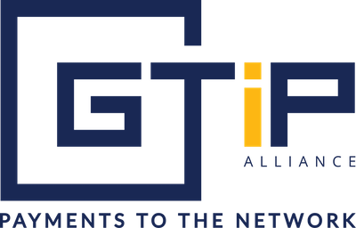

# GTiP-Crypto-Library

  

GTiP Crypto Library is a suite of post-quantum secure algorithms deployed within the GTiP cryptocurrency.

[Website](https://gtipalliance.org/) |
[Documentation](https://docs.gtipalliance.org/) |
[Mailing List](https://gtipalliance.org/) 

### License

GTiP Crypto Library is licensed under the MIT License.

### Contributing

We appreciate your willingness to contribute to the GTiP project and we are open to like-minded developers and contributors.  Please
familiarise yourself with our project practices on GTiP Crypto Library [Docs site](https://docs.gtipalliance.org).

